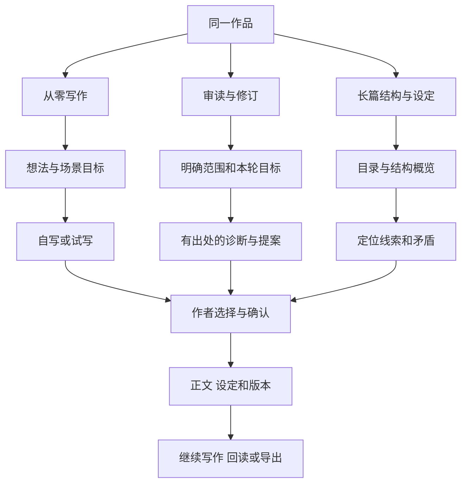

# Verso 产品与系统设计改进建议

分析日期：2026 年 10 月 8 日。对应仓库提交：`7d67b97`。

Verso 最值得继续强化的价值，是帮助作者在保有判断权的前提下，从想法形成稿件、理解并修订作品，以及持续管理长篇结构。根据本次明确的产品要求，**从零写作、已有稿件审读与修订、长篇结构与设定管理均属于核心范围**。三类任务应具有各自顺畅的流程，共用正文、版本、资料与作者决策规则。

当前设计已经有较好的基础：正文版本、非破坏性改稿提案、部分采纳、素材来源等级、带证据的偏好记忆。主要改进空间在于这些能力如何共同服务作者，而非继续增加孤立功能。

本文依据仓库文档、页面组成、领域模型和主要业务路径分析。界面相关结论来自源码所表达的交互，未进行浏览器实测、模型效果评测或作者访谈。优先级是设计判断；真实使用频率、阅读体验和耗时仍需验证。以下不包含代码重构、依赖升级或具体修复清单。

## 一 当前设计及其主要矛盾

### 三类任务均为核心 需要各自清晰的流程

README 同时面向小说、散文、诗歌和深度非虚构，既强调审读，也提供起草、扩写、知识管理和多媒体素材摄取。工作台则主要围绕作品、卷、场景和持续对话组织。这套结构更贴近叙事文本，各类体裁如何使用仍需明确。[E1][E2][E3]

三类任务都要支持，不意味着作者每次都需要面对全部功能。建议在同一作品中提供清楚的任务入口：开始写作、审读与修订、查看结构与设定。它们共享同一份作品，允许随时切换；不要求作者为切换任务创建新项目，也不必引入三套独立产品。

“诊断重于生成”适合已有稿件的修订；对空白稿件，应先澄清创作意图再协助试写；对长篇管理，应优先帮助作者理解结构与一致性。这三种工作方式的共同底线是作者决定正文和设定如何变化。

### 作者主体性已经进入数据设计 尚需贯穿操作过程

改稿案卷已有目标、理由、文本差异、全部或部分采纳，以及冲突状态。正文服务也有历史版本和恢复能力。但工作台的主要可见入口仍是“正文、设定、改稿”三个页签与聊天，恢复版本、管理偏好、带走定稿尚未形成同等清晰的使用路径。[E3][E5][E7][E8]

因此，后续重点应是让作者在每次决定前后都知道：AI 根据什么提出建议、自己接受了什么、作品发生了什么变化、是否能撤回。

### 文学原则需要容纳作者的不同选择

项目强调减法、留白和克制，同时又提供感官扩写、场景起草。这些能力可以共存，但需要说明各自服务什么目标。否则，“严肃文学”容易在使用中收窄为某一种语言风格，作者有意保留的繁复、重复或解释也可能被当成缺点。[E1][E4]

## 二 按优先级排列的设计建议

P0 表示建议优先明确的共同规则；P1 表示补齐三类核心任务的使用闭环。优先级表示依赖顺序，不表示任何一类使用方式被排除，也不代表线上故障等级或工期估算。

共同规则在三类任务中的含义是：从零写作时，明确试写目标、参考依据及作者选入正文的边界；修订时，明确目标稿件、版本及允许修改的范围；长篇管理时，区分计划、正文事实与待核对信息。以下 P0 以审读举例，但对象、作者意图和上下文边界应同时覆盖这三种情况；P1 负责把规则落实为各自的使用流程。

| 优先级 | 建议 | 主要收益 | 需要付出的设计代价 |
| --- | --- | --- | --- |
| P0 | 1 明确每次任务的对象和目标 | 减少范围误解和无效往返 | 增加少量任务信息 |
| P0 | 2 把文学判断与作者意图关联 | 避免单一审美替代作者判断 | 需要容纳不确定性和相反选择 |
| P0 | 3 统一上下文与能力边界 | 使冷读、全文审读等承诺可信 | 需要明确状态和责任归属 |
| P1 | 4 将提案组织成可完成的修订过程 | 降低比较、取舍和回读负担 | 需要调整信息组织方式 |
| P1 | 5 让偏好记忆由作者管理 | 保留风格变化与实验空间 | 需要轻量的确认和纠正入口 |
| P1 | 6 明确正文、设定和素材的解释关系 | 减少事实与创作意图区别不清 | 需要呈现矛盾及适用范围 |
| P1 | 7 完善稿件保存、恢复和导出体验 | 降低长期使用的不安和迁移成本 | 需要定义恢复与交付的边界 |
| P1 | 8 准确表达本地存储与模型外发 | 让作者能判断资料适用范围 | 需要展示处理方式和发送范围 |
| P1 | 9 按作品规模调整阅读与结构管理 | 支持长篇而不加重短篇使用 | 需明确结构信息的维护责任 |
| P1 | 10 为从零写作建立探索到成稿的路径 | 降低空白稿件起步负担 | 需区分试写与已选定内容 |

### 1 明确每次任务的对象和目标

**现状依据。** 工作台存在当前场景和附加引文，助手提供技能选择及节奏、对白快捷提问。但发送消息的主要信息是问题、引文和技能；当前场景及其版本没有作为明确的任务对象随之传递。通用助手指令又要求涉及正文时优先读取全项目正文。[E3][E4]

**设计问题。** 作者看到的“当前场景”和系统理解的“当前任务范围”未形成同一份约定。作者说“看看这一段”时，局部精读、场景审读和全篇分析可能混在一起。即使模型最终回答合理，作者也难以知道它是否依据了正确范围。

**建议。** 在提问区用一行可修改的信息明确本次范围，例如“选中段落 / 当前场景 / 全篇”，并允许作者简述本次目标及需要保留的特征。直接从选区发起时可带入选区，不需要每次填写表单。对需要全局信息的判断，明确区分“修改对象”与“允许参考的背景”。

一次任务应能说明：审哪份文本、对应什么版本、想解决什么、哪些内容应保留。讨论中可随时改变目标，但改变后应明确本轮依据；“继续上一轮”也应指向可辨认的任务，而不只依赖聊天位置。

**验收场景。** 作者在第二场选中一段，请求保留方言、只分析节奏。结果能明确指回第二场的该段，并说明是否参考了前后文；切换场景后查看旧结果，仍能知道它对应哪一稿。

**取舍。** 默认信息过多会打断写作，首次使用只需范围和一个可选目标。更完整的设置应按需展开。

### 2 把文学判断与作者意图关联

**现状依据。** 项目已有“文学取舍”字段与展示，也定义了创作意图类知识、作品语气偏好和技能关注点。新建作品主要填写标题与简介；审读技能主要按预设透镜工作。[E2][E4][E5][E6]

**设计问题。** “增强含蓄”“加快节奏”本身不是普遍成立的目标。没有作者意图作为参照，同一个段落可以被不同技能向相反方向修改，而作者缺少评判依据。

**建议。** 使用现有创作意图和偏好概念，给作者一个简短、可修订的作品说明：希望形成什么阅读感受、哪些语言特征是有意保留的。本轮目标可以临时覆盖长期偏好，不必将每次试验固化为作品规则。

审读结论应区分三种性质：文本中可核对的现象、可能产生的阅读效果、基于某个审美目标的选择。建议同时说明出处、预期收益与代价，并允许“保留原文”成为有解释的结果。只有作者需要时才展开替代写法，避免每个诊断自动变成改写任务。

例如，重复一句话可能使节奏迟滞，也可能有意形成执念。合适的反馈是指出具体重复及其效果，再结合作者目标讨论去留。

**验收场景。** 面对刻意繁复的段落，助手能识别其目标，讨论如何维持繁复而改善可读性；不会仅因项目强调减法就默认删削。冷读时不注入作者意图，反馈应标明这是初次读者感受。

**取舍。** 反馈会比简单的“问题与替换”更复杂，可优先展示少量最有影响的判断，其余按需展开。

### 3 统一上下文与能力边界

**现状依据。** 技能已声明是否使用知识、记忆和媒体；读取工具也定义了冷读限制；系统有上下文回执结构。但当前主要执行路径按技能筛选工具并保留通用读取工具，工具调用上下文仅明确传递项目、运行和会话标识，未在该处传入冷读标志或回执构建器。主聊天界面主要呈现回答、思考内容和错误。[E4][E9]

这说明项目已经考虑边界，但声明、执行和作者可见反馈尚未在主路径形成完整闭环。不能仅凭已有字段就认定“冷读隔离”和“所有上下文均有回执”已端到端兑现。

**建议。** 将审读范围、可读资料、可用能力和完成标准统一为一次任务的约定。技能负责审读方法；任务执行层负责落实边界；正文与设定服务负责作者批准后的修改及版本；界面负责展示依据与结果。这是职责划分，当前无需为此拆分更多服务。

作者应优先看到“读了哪些场景、使用了哪些背景、哪里尚未覆盖”。技术性的调用记录可保留在详情。全文审读遇到预算、取消或材料读取失败时，应显示已完成范围与未完成部分，不能让一段自然结束的回答承担“已经读完”的含义。

**验收场景。** 冷读任务不引用隐藏设定；只读过两场的任务明确限定结论；正文后来更新时，历史结论仍显示原来的文本版本。任务失败时，作者能辨认已经产生的提案和尚未完成的分析。

**取舍。** 需要接受“部分完成”作为正常业务结果。早期可以先做文字摘要，无需建立复杂的执行监控面板。

### 4 将提案组织成可完成的修订过程

**现状依据。** 现有案卷支持目标、理由、差异、部分采纳及冲突提示；正文与提案位于互斥页签；常规文本提案工具每次生成一份案卷和一项修改。[E3][E5]

**设计问题。** 作者真正要决定的是“这一轮是否解决了节奏问题”，而案卷容易被组织成若干独立替换。逐项采纳并不自然等于完成一轮有连贯意图的修订。

**建议。** 沿用现有案卷作为一轮修订的载体，将同一目标的建议组织起来，让作者能从判断跳到原文、比较差异、保留或采用，再回到完整段落阅读。聊天适合讨论，案卷适合保存决策，两者应互相定位。

允许表达“这个问题成立，但这个写法不合适”“暂缓处理”和“保留原文”。有因果依赖的建议，应说明单独采纳的影响。例如删除铺垫与补写后文解释是一组选择时，不宜表现成完全独立的两次字句替换。

修改后的回读应优先围绕本轮目标，避免刚接受一批改动就自动开启下一轮无限审读。

**验收场景。** 作者能从一条节奏诊断定位原文，采纳其中一个方案，回读完整段落，并在稍后找到当时保留另一处原文的理由。

**取舍。** 无需强制每次小修改经历完整流程；单句提案仍可快速处理。组织复杂度应随修改范围增加。

### 5 让偏好记忆由作者管理

**现状依据。** 记忆模型已区分作用域、明确表达与推断，并支持证据、争议、停用等状态；服务有记录与遗忘能力。当前工作台未提供相应管理入口。现有记录服务在创建推断偏好时也可能直接设为生效；这不能证明用户的普通点击已自动进入该服务。[E7]

**设计问题。** 某次删改可能只是特定人物、体裁或场景的需要，不一定代表作者的长期审美。若作者无法看到系统认为自己“喜欢什么”，即使记忆附有证据，也难以纠正。

**建议。** 明确区分“仅本次要求”“本作品偏好”“跨作品习惯”。明确指令按作者选择的范围生效；推断出的长期偏好先作为候选，允许确认、修改或忽略。发生矛盾时优先呈现适用条件，不把风格变化简单解释为旧偏好错误。

复用已有证据和停用能力，提供简短可读的条目，例如“本作品保留重复句式”，同时可查看它来自哪次决定。接受或拒绝一项改稿只表明当次决定，不直接等同于永久规则。

**验收场景。** 作者在一篇作品中采用冷峻文风，在另一篇中尝试华丽表达，两者不会无提示互相覆盖；作者可以查看并停用某条推断。

**取舍。** 不应每次操作都询问是否记住。确认可在作者主动提出或一轮修订结束后集中呈现。

### 6 明确正文 设定和素材的解释关系

**现状依据。** 知识模型已有来源权威等级、场景与卷作用域，以及矛盾等关系类型；检索设计会考虑范围和权威等级。界面主要以分类卡片管理内容。[E6]

**设计问题。** “由作者写下”“已确认”“在故事里真实”“当前读者已经知道”是不同含义。正文可能采用不可靠叙述，人物小传可能包含尚未披露的事实，访谈素材可能记录受访者观点。单一权威排序不能回答这些解释问题。

**建议。** 先明确三类内容的用途：正文记录当前稿件如何表达；设定记录作者希望维持的创作约束；素材记录可追溯的参考来源。发生矛盾时，审读应指出出处并请求作者判断，而非把高权威条目直接当成修改正文的理由。

对需要的作品，再表达信息适用范围，例如某人物所知、某时间点成立、仅为待定构想。沿用已有作用域和来源概念即可；没有实际需要时，不预设完整的世界模拟模型。

**验收场景。** 正文中的人物说谎，与人物设定存在表面矛盾，助手能够将其列为需要辨别的叙事现象；非虚构引用能追溯到原始素材，而非只显示一段提炼后的结论。

**取舍。** 对纯粹的短篇审读，这部分应可选。首先呈现来源及冲突，复杂关系视图的必要性需单独验证。

### 7 完善稿件保存 恢复和导出体验

**现状依据。** 系统具备正文版本、恢复服务、版本比较工具，以及命令行备份恢复脚本；主工作台未见面向作者的历史恢复和成稿导出入口。[E8]

**设计问题。** 作者长期把作品留在系统里的前提，是能确认稿件已保存、理解恢复会影响什么，并在需要时取出可使用的版本。内部存在历史记录不足以独立满足这些需求。

**建议。** 区分正在编辑的内容、已保存的稿件、某轮修订完成的版本，以及准备对外交付的版本。小规模使用只需明确保存状态和少量可辨认的历史节点，不必建立分支管理系统。

让作者能查看关键版本、比较并恢复，同时说明恢复的范围。尤其是分场操作会改变作品结构，“恢复某场正文”和“撤回整次分场”不应被混为一件事。对外导出则应提供清洁稿，并明确是否包含批注和审读记录；具体格式取决于投稿、编辑交流或个人归档的实际需要。

**验收场景。** 作者完成一轮改稿后能关闭并重新找到该版本；能辨认恢复操作的影响；能导出一份不含内部对话和调试信息的成稿。

**取舍。** 优先满足一种真实交付方式。没有明确需求时，不承诺多格式排版、多人合稿或出版管理。

### 8 准确表达本地存储与模型外发

**现状依据。** README 强调本地存储与未授权外发限制。服务支持配置模型端点，并会向该端点发送模型请求；配置支持远程服务地址。这意味着本地保存和模型处理位置是两个独立的产品边界。[E1][E10]

**设计问题。** 作者可能把“本地工作台”理解为“正文始终不离开电脑”，而实际处理范围取决于模型和素材处理配置。不能由本地数据库和回环监听推导出完全离线。

**建议。** 准确展示当前资料保存位置、模型处理方以及本次允许发送的内容范围。单用户自行配置时，可在首次配置或处理方式改变时确认规则，日常沿用已明确的选择，避免反复弹窗。对于有特殊保密要求的作品，应能在调用前判断当前处理方式是否适用。

**验收场景。** 作者知道“文件存本机、选定正文会发给已配置的模型服务”；切换到本地模型或更换服务商后，描述同步变化。是否留存、训练等第三方政策应以实际服务条款为准，不能由项目代为保证。

**取舍。** 需要准确的简短说明，通常不需要增加复杂的权限产品。

### 9 按作品规模调整阅读与结构管理

**现状依据。** 项目支持分场、场景摘要、视点与时间信息，也有全文与分页读取工具；主界面通过场景下拉框切换正文，通用助手指令倾向先读全文。[E2][E3][E4]

**设计问题。** 在长篇使用中，逐场切换和反复整篇阅读可能增加结构定位和等待的负担，也使作者更难辨认分析覆盖范围。其影响程度尚未经过真实长篇测量。

**建议。** 围绕现有卷和场景建立简洁目录与连续阅读入口，并区分三类任务：局部语言推敲、跨场景线索核对、全篇结构审读。三类任务应有不同的阅读范围和完成标准，不能把同一份全篇分析当成所有问题的默认前置步骤。

结构视图先回答“发生了什么、由谁看见、处于何时、在哪一段”，并区分计划中的安排与正文已经写出的事实。场景内容改变后，应让作者知道哪些摘要、人物信息或线索判断需要重新核对，避免结构视图逐渐脱离正文。

分场建议应同时说明保持了哪些原文内容以及改变了怎样的阅读节奏。文字覆盖完整只能证明没有遗漏文本，不能证明切分具有文学合理性。

**验收场景。** 对一部真实长篇，作者可从一个结构问题定位到相关场景，并知道结论来自全文精读、局部原文还是摘要。对短篇仍可直接阅读，不必先建立人物和时间线。

**取舍。** 长篇管理属于核心范围，但可先用目录、摘要和待核对事项形成闭环；关系图和复杂时间轴的必要性另行验证。短篇作者应能直接阅读，不被要求维护同等数量的结构资料。

### 10 为从零写作建立探索到成稿的路径

**现状依据。** 项目可创建空白作品和初始场景，也提供场景起草、感官扩写技能；工作台仍以正文、设定和助手对话为主要组织方式。[E2][E3][E4]

**设计问题。** 已有稿件可以选区并审读，空白作品则缺少天然的任务对象。作者可能只有一个人物、一幅画面或一种情绪，既不适合直接接受完整大纲，也不一定愿意让 AI 一次生成整场正文。起草技能的存在尚不能单独构成持续写作流程。

**建议。** 提供轻量的起步方式：从一个想法、一段自写文本或一个场景目标开始。助手先帮助作者明确下一小段要完成什么，再根据作者选择提供讨论、素材启发或试写。大纲与人物档案按需形成，不作为开始落笔的前置作业。

试写内容应有明确去向：仍在比较、留作素材，或由作者选入正文。选入后沿用现有正文和版本规则；未被选中的内容不自动变成正式设定，也不成为后续审读默认成立的情节。无需为每个试写方案建立完整版本分支。

持续写作时，应帮助作者恢复上次的写作位置与尚未完成的意图，并能切换到审读或结构管理。探索阶段允许不确定性，不因没有完整情节就提前要求解决所有逻辑问题。

**验收场景。** 作者只输入一个人物和一幅画面，可以自写一段或请求一个局部试写，明确选择哪些内容进入正文；次日继续时能回到原位置。切换到审读后，助手只将已选定正文与已确认设定作为作品事实。

**取舍。** 起步引导应可跳过。对习惯直接写作的作者，保持空白编辑器可立即落笔，避免问卷化创作。

## 三 三条工作流程共用同一份作品

三类任务分别验收，底层共用现有正文、案卷、资料与版本概念。作者在同一作品中切换任务，不需要复制稿件或重新建立上下文。

这些流程不要求每一步新增页面。局部推敲可以在现有双栏中完成；写作时突出编辑区域，审读时方便比对原文与判断，管理长篇时突出目录及其关联信息。扩大范围或跨版本操作时，再补充必要信息。

建议先确定 P0 的共同规则，再分别完成三条最小闭环：从一个想法写成并保存一段正文；对已有段落完成一次有理由的取舍；从长篇结构问题定位并核对相关场景。随后完善偏好、恢复和交付体验。三条流程应在同一作品上串联验证，而非各自演示成功就认定产品完整。

## 四 如何判断设计改进是否有效

选择空白作品、普通短篇、刻意采用特殊文风的文本和一部真实长篇，分别验证三条核心流程。观察作者完成任务的过程，不把生成字数、建议数量或采纳率单独当作质量指标；有理由地保留原文也是有效结果。

| 观察项 | 判断方式 |
| --- | --- |
| 起步是否顺畅 | 从一个想法到第一段已保存正文，是否需要理解过多设置 |
| 结构是否有助定位 | 能否从长篇问题找到相关原文，并识别过时的摘要或设定 |
| 对象是否清楚 | 作者能否指出本轮范围、文本版本和使用的背景 |
| 判断是否有用 | 作者能否解释建议为何适用，或为何应保留原文 |
| 操作是否连贯 | 从诊断到定位、取舍、回读，是否需要反复找内容 |
| 结果是否可追溯 | 隔一段时间后能否找到修改内容及当时理由 |
| 风格是否受尊重 | 有意保留的语言特征是否被持续识别 |
| 边界是否可信 | 局部审读、冷读和部分完成是否被准确表达 |

先记录当前基线，再确定目标。阅读时间、返回次数、等待时间等可作为辅助观察，不预设缺乏依据的提升百分比。

## 五 仍需确认的产品选择

已确认：从零写作、已有稿件修订和长篇管理全部支持，无需再次选择其中一项。后续细化设计时仍需明确：

1. 作者是否同时使用外部编辑器？这决定是否需要频繁往返导入导出，以及怎样辨认稿件版本。
2. 常用体裁、真实长篇规模和组织习惯是什么？这决定目录、连续阅读和结构信息的展示方式，不能直接把小说的卷场景层级套到所有作品。
3. 作者希望助手参与到什么程度：讨论、局部试写还是较完整的起草？这些可以按任务选择，默认介入程度需验证。
4. 作者愿意将哪些资料发给已配置模型，最终稿需要如何交付？这决定模型使用说明与导出要求。

这些细节尚未确认时，可以明确三条核心流程及其共同规则。多人协作、技能市场、复杂关系图等额外扩展仍应由具体需求决定。

## 六 现有设计中仍需关注的风险

- 声明的上下文隔离和回执能力，可能尚未在实际主流程中完整兑现。
- 技术上的锚点匹配、版本一致和文本覆盖率，不能证明文学判断或结构调整合理。
- 不可见或过度泛化的偏好，可能逐渐限制作者的风格变化。
- 页面保存与恢复的实际可靠性、长篇处理效果以及模型审读质量，仍缺少本次分析之外的运行证据。

## 附录 事实依据

以下链接用于复核当前设计。建议与验收场景属于本文提出的方案，不代表功能已经实现；领域模型或服务存在，也不代表主界面已提供相应能力。

| 编号 | 仓库位置 | 支持的现状判断 |
| --- | --- | --- |
| E1 | [中文说明](../README_zh.md) | 产品定位、作者主体性、减法原则、隐私表述及功能范围 |
| E2 | [作品模型](../shared/schemas/project.ts)、[工作区入口](../app/routes/_index.tsx)、[创建作品](../app/components/workspace/CreateProjectModal.tsx) | 作品与卷场景结构、作品设置、初始创建流程 |
| E3 | [工作台](../app/components/workbench/WorkbenchShell.tsx)、[顶部导航](../app/components/workbench/WorkbenchHeader.tsx)、[素材页签](../app/components/workbench/MaterialTabs.tsx)、[助手面板](../app/components/workbench/AgentPane.tsx) | 场景选择、双栏与页签、编辑模式、提问信息和技能入口 |
| E4 | [技能定义](../server/skills/definitions.ts)、[技能运行规则](../server/skills/skill-runtime.ts)、[助手运行流程](../server/agent/runtime/agent-runtime.ts) | 审读方法、上下文政策、工具集合、默认全文读取和任务执行方式 |
| E5 | [改稿卡片](../app/components/changes/ChangeSetCard.tsx)、[改稿页签](../app/components/changes/ChangesTabContent.tsx)、[提案工具](../server/agent/tools/proposal-tools.ts)、[改稿服务](../server/domain/change-sets/change-set-service.ts) | 目标、理由、差异、部分采纳、冲突及案卷组织 |
| E6 | [知识模型](../shared/schemas/knowledge.ts)、[范围检索](../server/domain/retrieval/hierarchical-retriever.ts)、[知识页签](../app/components/knowledge/KnowledgeTabContent.tsx) | 来源权威、范围、关系类型和分类管理 |
| E7 | [记忆模型](../shared/schemas/memory.ts)、[记忆服务](../server/domain/memory/memory-service.ts)、[记忆接口](../app/routes/api.projects.$projectId.memory.ts)、[工作台](../app/components/workbench/WorkbenchShell.tsx) | 候选与生效状态、偏好证据、作用域、遗忘及界面入口边界 |
| E8 | [正文版本服务](../server/domain/manuscripts/manuscript-service.ts)、[备份](../scripts/backup.ts)、[恢复](../scripts/restore.ts)、[路由入口](../app/routes.ts)、[工作台](../app/components/workbench/WorkbenchShell.tsx) | 版本与恢复基础、命令行备份、当前作者界面入口 |
| E9 | [读取工具](../server/agent/tools/read-tools.ts)、[回执构建](../server/agent/context/context-receipt-builder.ts)、[助手运行流程](../server/agent/runtime/agent-runtime.ts)、[对话展示](../app/components/agent/AgentThreadView.tsx) | 冷读限制与回执概念、主路径中的传递方式、作者可见信息 |
| E10 | [部署声明](../compose.yaml)、[服务端配置](../server/config/env.ts)、[模型请求](../server/models/openai-client.ts) | 本地存储及端口边界、可配置模型端点、请求发往配置端点 |
