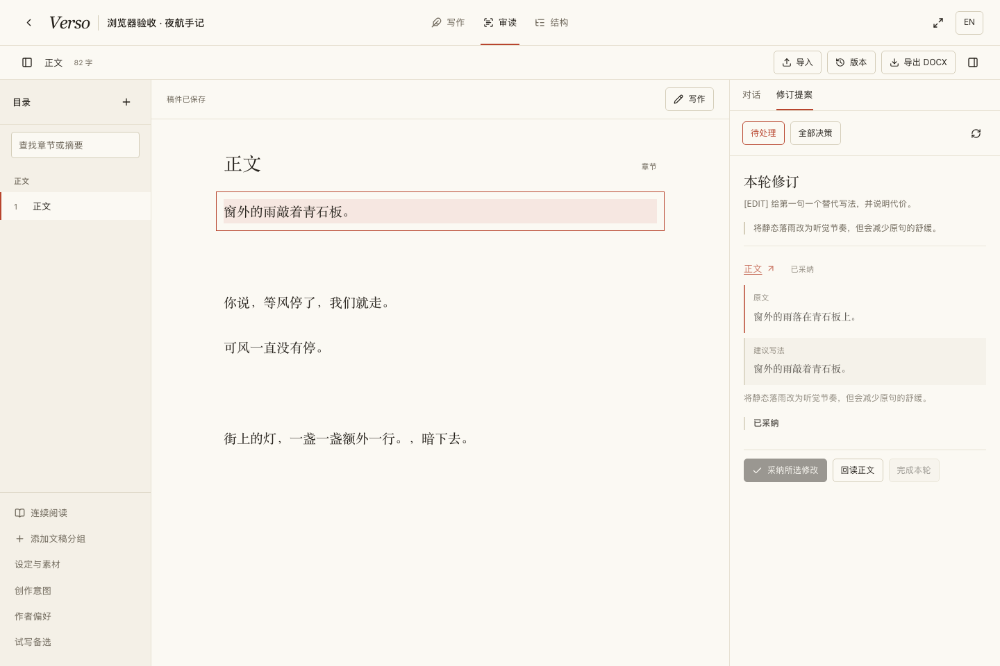
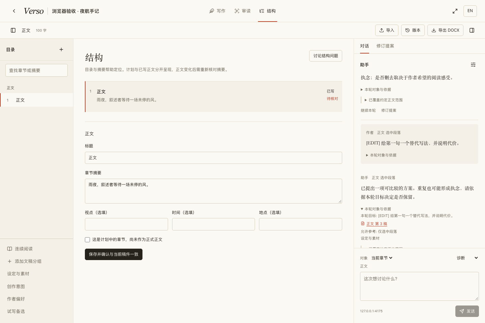
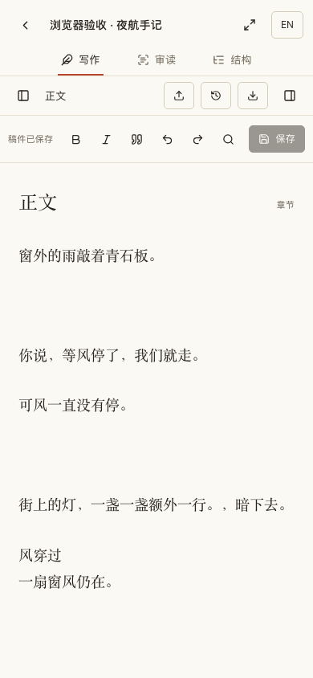

# Verso 工作台重构与验收

依据：[产品与系统设计改进建议](design-review-2026-10-08.md)。

保留米白纸面、墨色正文和朱红定位线，以系统宋体呈现稿件、系统无衬线字体呈现操作。正文始终在中央；目录与助手可收起，窄屏改为抽屉。写作、审读、结构共用一份作品和版本记录。使用 frontend-design 与 webapp-testing 技能指导设计及浏览器验收。

## 十项建议的实现

| 建议 | 已实现行为 |
| --- | --- |
| 1 任务对象与目标 | 选区、当前章节、整部作品；修改目标和参考背景分开；固定已保存版本；本轮目标、保留特征和继续任务均可辨认。 |
| 2 文学判断与作者意图 | 可编辑创作意图；默认讨论，明确选择后才提案或试写；提示区分文本现象、阅读效果和审美取舍。冷读不注入作者意图。 |
| 3 上下文与能力边界 | 工具执行层限制范围及资料权限；保存正文读取区间和来源版本；部分完成、失败、取消保留回答与回执。历史稿不能绕过“仅选区”限制。 |
| 4 完整修订过程 | 正文与提案同时显示；原文定位、差异比较、部分采纳、依赖组、保留理由、暂缓、回读及完成本轮。旧决策可查。 |
| 5 作者管理偏好 | 明确偏好按范围生效；推断先作为候选；作者可确认、修改和停用；普通采纳不自动成为永久规则。 |
| 6 正文、设定与素材 | 分开呈现用途、来源、适用条件及已有冲突关系；保留原始附件入口；设定提取先提案，经作者采纳后生效。过时设定提案不能覆盖新内容。 |
| 7 保存、恢复与交付 | 显式保存与快捷键；浏览器草稿恢复；保存冲突时保留编辑并展示对照；命名检查点、历史对比、恢复为新版本；导出清洁 DOCX。 |
| 8 本地存储与模型外发 | 展示配置模型的处理方和发送范围；首次使用及端点变化须确认；素材处理说明覆盖整份文件的可能外发。 |
| 9 阅读与结构管理 | 文稿组和章节目录、检索、连续阅读；结构呈现摘要、视点、时间、地点与计划状态；正文变化后摘要标为待核对。 |
| 10 探索到成稿 | 空白稿可直接落笔；讨论、局部试写由作者选择；试写可部分选入、留作待定素材或不采用；恢复写作位置与下一步意图。 |

新工作台统一使用 JSON 接口处理保存与导入，删除旧保存操作和闲置工作台组件，没有保留新旧双实现。一次性迁移将未确认的推断偏好转为候选，并统一历史 AI 采纳版本类型。DOCX 导出只包含正式正文，保留基本强调与诗歌换行，排除计划章节、对话及未采纳试写。

## 验收边界

- `npm run typecheck`、`npm run build`、`npm run lint`；lint 有现存及新增的 React Hooks 警告，无错误。
- `npm test`：31 个文件、128 项测试通过，包括来源固定、冷读隔离、局部及全文覆盖、长章节部分完成、设定采纳和过时冲突、试写单次选入、偏好作用域、版本恢复及 DOCX 内容。
- Playwright 桌面 1440 × 960、移动端 390 × 844：在同一诗歌项目串联创建、编辑保存、选区讨论、提案比较采纳、回读、历史来源、局部试写、偏好停用、结构摘要过期、导出、取消、模型失败和抽屉操作。
- 额外浏览器检查：刷新恢复草稿；通过第二次真实 API 保存制造版本冲突，作者比对并确认后保存；命名检查点及恢复新增历史；导入新章节与确认覆盖导入。
- 浏览器使用隔离的 `verso_test` 数据库及本地模拟模型服务；没有将这些结果称为真实模型质量验收。浏览器测试未出现未捕获的页面异常。
- 已执行 `docker-compose up -d --build web worker`，`verso_web` 与 `verso_worker` 均运行最新构建；就绪接口返回 `ready`、数据库 `healthy`、pgvector 可用，worker 正常监听任务队列。部署后首页与多体裁新建表单通过只读浏览器冒烟检查，没有创建正式项目或调用真实模型。

## 截图

桌面审读与回读：

结构及摘要待核对：

移动端写作：

## 剩余风险

尚未使用真实模型评测文学判断，也未以真实长篇衡量阅读性能与上下文预算。章节正文恢复不撤销整次分场的结构变化；DOCX 是基本清洁稿，不包含复杂出版排版。
